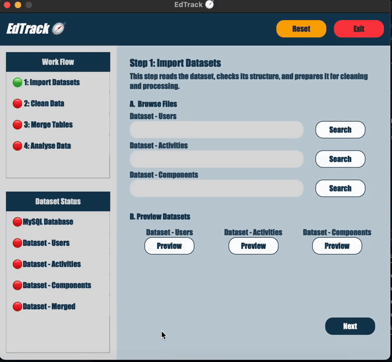

# EdTrack - Data Integration Toolkit

<br/>


## I. Overview

A refactored version of my earlier coursework rebuilt into a modularised Python application. Redesigned the client-side workflow with a new PyQt5 interface, together with the server-side data-processing pipelines with modules of import/export, cleaning, transforming and visualising student activities logs.

It is designed to tailor-made a standard workflow for analysing student engagement and supports exporting processed datasets into designated format and storing persistent data in a SQL database.

<br/>

## II. Features

- Import/export datasets and connect to a SQL database
- Form modular data-processing pipeline (Loader, Cleaner, Transformer, Visualiser, etc.)
- Basic data visualisation with Matplotlib heatmaps and pivot tables

<p>
  
</p>

<br/>

## III. Architecture

<i> Read `architecture.md` for further information of design and module reponsibilities.  </i>


###  A.  Overall Design

This project adopts a modular, layered architecture that separates UI, logic, and data operations to maintain clarity, scalability and maintainability.


### B.  MVC Layered Structure

The system follows an MVC-inspired structure: views handle UI components, controllers coordinate behaviours, and models manage data operations.


### C.  Object-oriented Programming

The system applies OOP to break data handling and workflow logic into small, independent modules following single-responsibility principles. Encapsulation and abstraction decoupled the modules and enable new features to be extended or overridden without impact the overall structure.


<br/>

## IV. Project Structure

```
controllers/   # logic layer: bridge views and models, manage user
data/          # Raw input or interim processed data
docs/          # internal documentation and architectural diagrams
infra/         # Infrastructure: logging
models/        # Data layer: database management, data transformation
output/        # File generation: exported files and reports
state/         # State management: handle state for cross-modules
views/         # UI layer: all UI components and structure workflow
```

<br/>

## V. Workflow

### A. High-level Overview

```
[Action]  ->  [Views]  ->  [Controllers]  ->  [Models]  ->  [Controllers]  ->  [Views]
 (user)      (widgets)      (controller)    (data pipeline)                 
```

### B. Models - Data Pipelines

```
[Loader]  ->  [Cleaner]  ->  [Manager]  ->  [Preprocessor]  ->  [Manager]  ->  [Visualiser]  ->  [Loader]
(import)      (cleaning)      (merge)      (feature engineer)  (transform)      (visualise)      (export)
```

### C. Views - User Interface

```
[UserInterface]  -> [LayoutFactory]  ->  [PageFactory]  ->  [ComponentFactory]
 (main window)                                                 (component)
```

<br/>

## VI. Installation

 <i> Clone the Project </i>

```
$ git clone https://github.com/chkfu/Practice_student-activities.git
$ cd Practice_student-activities
```

 <i> Build Virtual Environment </i>

```bash
$ python -m venv .venv

# macOS / Linux
$ source .venv/bin/activate
# Windows
$ .venv\Scripts\activate
```

 <i> Install Dependencies and run the program: </i>
```
$ pip install -r requirements.txt
```
```
$ python3 app.py
```

<br/>

## VII. Usage Guide

### A. Initialise the Program

Run the command:
```
$ python3 app.py
```

### B. Navigation Bar

The Navigation Bar handling user behavior which is relevant to application lifecycle:

(1) Reset button: Clears all temporary states and restores global default settings.<br/>
(2) Exit button: Safely shuts down all running processes.<br/>

### C. Side Bar

The Side Bar display the workflow progress and the dataset status.

### D. Content

The Content is the work panel for the application, enabling users to adjust the configurations for data transformation and further analysis.

(1) Browse button: Opens a file dialog to select an input dataset.<br/>
(2) Preview button: Displays a pop-up window with tables or diagrams, including export options.<br/>
(3) Export Button: Opens a file dialog to choose an output destination.<br/>
(4) Navigation Button: Moves between workflow pages.<br/>
(5) Reset Button: Restores the current page to default settings.<br/>

<br/>

## VIII. Dependencies

| Category | Package    | Version |
|----------|------------|---------|
| Runtime  | Python     | 3.10    |
| Library  | pandas     | 2.3.3   |
| Library  | numpy      | 2.3.4   |
| UI       | PyQt5      | 5.15.11 |
| Plotting | matplotlib | 3.10.7  |

See `requirements.txt` for the full package list.

<br/>

<i> Author: kchan </i>
</br>
<i> Last Updated: Nov 27, 2025 </i>