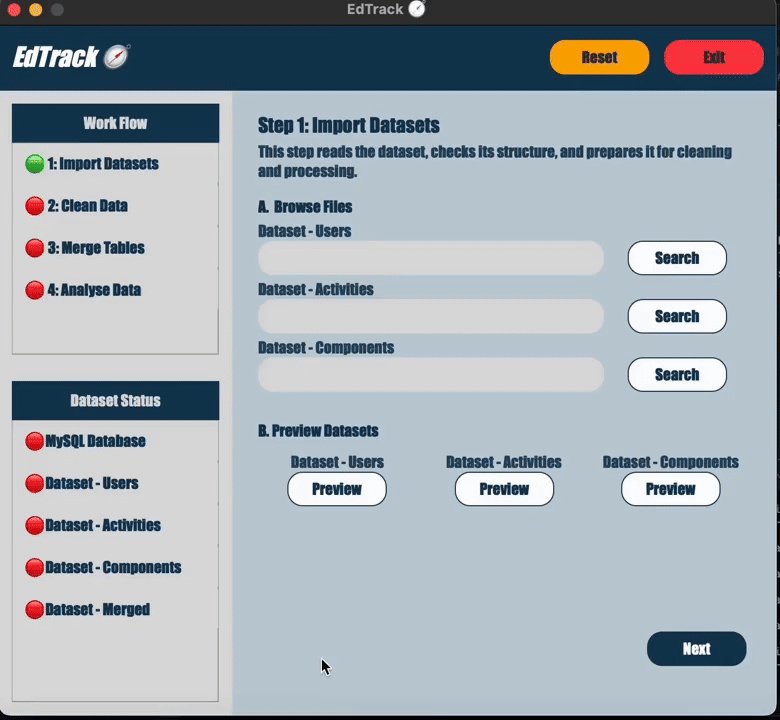

# EdTrack - Data Integration Toolkit

<br/>

## Contents
- [I. Overview](#i-overview)
- [II. Features](#ii-features)
- [III. Architecture](#iii-architecture)
- [IX. Project Structure](#iv-project-structure)
- [V. Workflow](#v-workflow)
- [VI. Installation](#vi-installation--initialisation)
- [VII. Testing](#vii-testing)
- [VIII. Usage Guide](#vii-usage-guide)
- [IX. Technical Considerations](#viii-technical-consideration-and-limitations)
- [X. Dependencies](#ix-dependencies)

<br/>


## I. Overview

A refactored version of my earlier coursework rebuilt into a modularised Python application. Redesigned the client-side workflow with a new PyQt5 interface, together with the server-side data-processing pipelines with modules of import/export, cleaning, transforming and visualising student activities logs.

It is designed to tailor-made a standard workflow for analysing student engagement and supports exporting processed datasets into designated formats.

<br/>


## II. Features

- PyQt5 interface for managing the data-processing workflow
- Modularised data-processing for importing, cleaning, transforming, and analysing student activities
- Pivot-table-based data exploration and analysis of student engagement
- Engineering-oriented project structure with OOP design, logging, testing, and centralised state management

<p>
  
</p>

<br/>


## III. Architecture

<i>* Read `architecture.md` for further information of design and module reponsibilities.  </i>


###  A.  Overall Design

This project adopts a modular, layered architecture that separates UI, logic, and data operations to maintain clarity, scalability and maintainability.


### B.  MVC Layered Structure

The system follows an MVC-inspired structure: views handle UI components, controllers coordinate behaviours, and models manage data operations.


### C.  Object-oriented Programming

The system applies OOP to break data handling and workflow logic into small, independent modules following single-responsibility principles. Encapsulation and abstraction decoupled the modules and enable new features to be extended or overridden without impact the overall structure.


<br/>

## IV. Project Structure

<i>* Read `architecture.md` for further information of design and module reponsibilities.  </i>

```
controllers/   # Logic layer: bridge views and models, manage user
data/          # Raw input or interim processed data
docs/          # Internal documentation and architectural diagrams
infra/         # Infrastructure: logging
models/        # Data layer: database management, data transformation
output/        # File generation: exported files and reports
state/         # State management: handle state for cross-modules
tests/         # Testing: unit tests
views/         # UI layer: all UI components and structure workflow
```

<br/>

## V. Workflow

<i>* Read `architecture.md` for further information of design and module reponsibilities.  </i>

### A. High-level Overview

```
[Action]  ->  [Views]  ->  [Controllers]  ->  [Models]  ->  [Controllers]  ->  [Views]
 (user)      (widgets)      (controller)    (data pipeline)                 
```

### B. Models - Data Pipelines

```
[Loader]  ->  [Cleaner]  ->  [Manager]  ->  [Preprocessor]  ->  [Manager]  ->  [Visualiser]  ->  [Loader]
(import)      (cleaning)      (merge)     (feature engineer)   (transform)      (visualise)      (export)
```

### C. Views - User Interface

```
[UserInterface]  -> [LayoutFactory]  ->  [PageFactory]  ->  [ComponentFactory]
 (main window)                                                 (component)
```

<br/>

## VI. Installation / Initialisation

### A. Download the App

**[Download latest release](https://github.com/chkfu/Practice_student-activities/releases/latest)**

### A. Clone the Project

```
$ git clone https://github.com/chkfu/edtrack-workflow-integration-toolkit.git
$ cd Practice_student-activities
```

 <i> Build Virtual Environment </i>

```bash
$ python -m venv .venv

# macOS / Linux
$ source .venv/bin/activate
# Windows
$ .venv\Scripts\activate
```

 <i> Install Dependencies and run the program: </i>
```
$ pip install -r requirements.txt
```
```
$ python3 app.py
```

<br>


## VII. Testing

All testing files are located at `tests/` folders.  

With the example of `TestDataCleanerBasic.py"` file, run the unit test specifically with the code:

```
$ pytest tests/test_data_cleaner_basic.py -v
```

Additionally, the shortcut to run all tests under `tests/` folder, consider the code in below:

```
pytest tests/ -v
```

<br/>

## VIII. Usage Guide

### A. Initialise the Program

Run the command:
```
$ python3 app.py
```

### B. Top Bar

The Top Bar handling user behavior which is relevant to application lifecycle:

(1) Reset button: Clears all temporary states and restores global default settings.<br/>
(2) Exit button: Safely shuts down all running processes.<br/>

### C. Side Bar

The Side Bar display the workflow progress and the dataset status.

### D. Content

The Content is the work panel for the application, enabling users to adjust the configurations for data transformation and further analysis.

(1) Browse button: Opens a file dialog to select an input dataset.<br/>
(2) Preview button: Displays a pop-up window with tables or diagrams, including export options.<br/>
(3) Export button: Opens a file dialog to choose an output destination.<br/>
(4) Navigation button: Moves between workflow pages.<br/>
(5) Reset button: Restores the current page to default settings.<br/>

<br/>


## IX. Technical Consideration and Limitations

###  A. Design Trade-off

#### (1) Centralisation vs. Maintainability

- Solution:
Dictionary mapping and reusable methods are adopted for repeated widget constructions, such as option containers and tab content, to reduce duplicated code and maintain visual consistency.

- Trade-off:
Centralised logic causes core methods to grow in complexity over time. To avoid overwhelming fragmentation, related functionalities are grouped together, allowing developers to follow the logical flow sequentially rather than jumping across many small pieces.


#### (2) Linear Workflow vs. Tab Branches

- Solution:
The Analyse stage is split into three independent tabs — pivot tables, metric calculation, and graph visualisation — giving users focused control over each task without enforcing a fixed sequence.

- Trade-off:
This introduced duplicated widget components (dropdowns, checkboxes, tabs) across tabs, increasing code complexity. However, it simplifies the user experience by providing dedicated, straightforward interfaces for each analytical task.


#### (3) Timing of Component Refresh

- Solution:
Parameter selections depend on data from previous pipeline stages, which are unavailable at PyQt5's initial build time. Mouse events are used to trigger component updates and display up-to-date options when needed.

- Trade-off:
Most option widgets refresh at the page level (via the Next button) to avoid overloading the app with frequent re-render requests. Only a few selections in the feature engineering stage require immediate re-rendering to reflect live data changes.


#### (4) SQL Connection Excluded from UI

- Solution:
SQL connectivity was implemented early in development, but persistent storage is not essential for the core use case of guiding users through a structured data processing pipeline.

- Trade-off:
The UI components for SQL were hidden to keep the interface focused. The underlying connection logic remains in `FileController` as legacy code for potential future use.


### (B) Limitations

#### (1) Graph Visualisation Deferred

- Removed graph visualisation in the current version due to scope constraints. 
- Planning to implement matplotlib diagrams in the future version.

#### (2) Subsequent test modules

- The project prioritised unit tests for data -cleaning due to frequent reuse and the foundation to support the data analytical pipeline. 
- Planning to implement all unit tests for data transformation and preprocessing methods, as well as integration tests in the future version.


<br/>


## X. Dependencies

| Category | Package    | Version |
|----------|------------|---------|
| Runtime  | Python     | 3.13.0  |
| Library  | pandas     | 2.3.3   |
| Library  | numpy      | 2.3.4   |
| UI       | PyQt5      | 5.15.11 |
| Testing  | pytest     | 8.4.2   |

See `requirements.txt` for the full package list.

<br/>


<i> Author: kchan </i>
</br>
<i> Last Updated: Mar 15, 2026 </i>